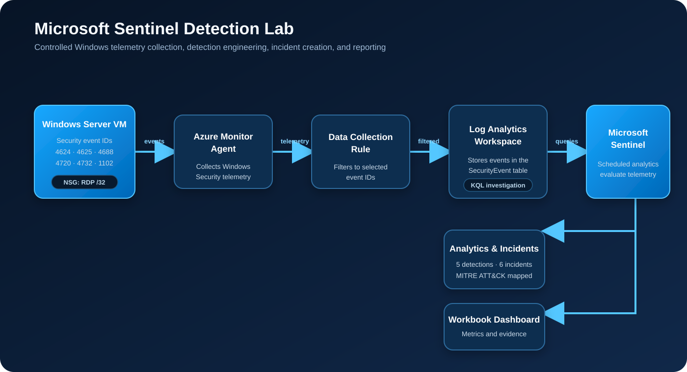
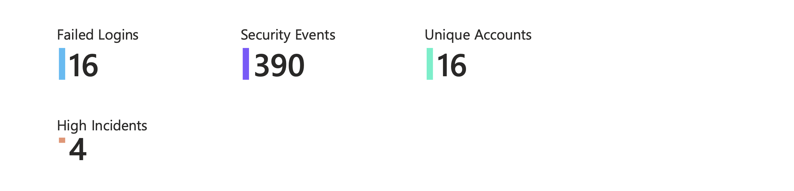
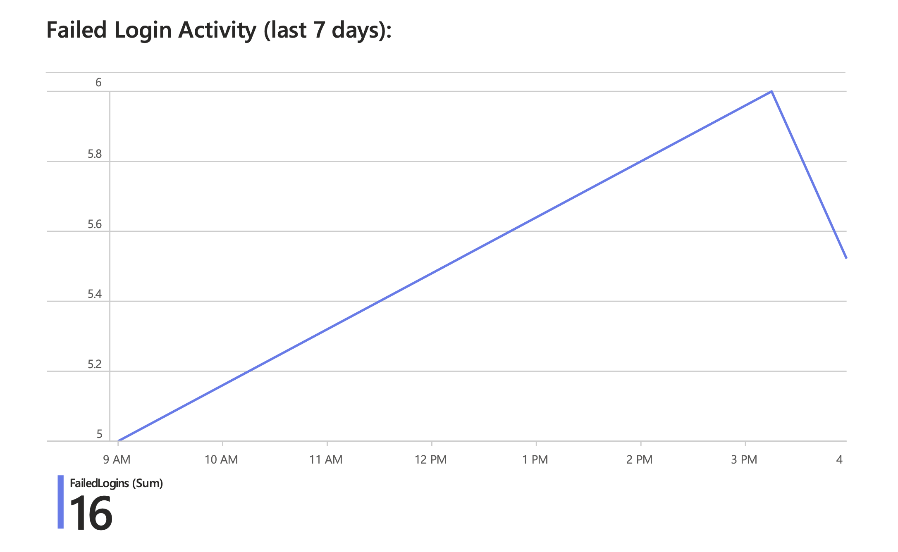
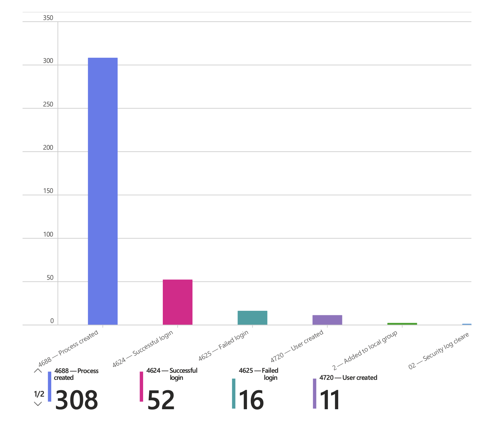
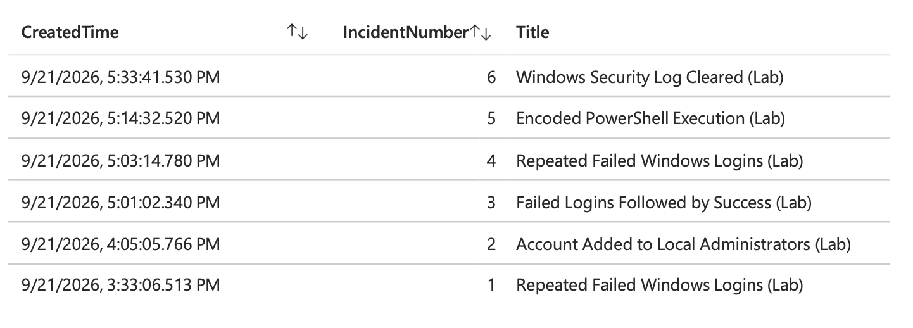

# Microsoft Sentinel Detection Lab

A controlled Microsoft Azure security operations lab that collects Windows security telemetry, detects suspicious activity with KQL analytics rules, creates Microsoft Sentinel incidents, and summarizes results in a custom workbook.

All activity in this repository was generated intentionally in an isolated lab. It does not contain data from real attackers or production systems.

## What I built

- Deployed a Windows Server 2022 Azure VM and restricted RDP access to a single trusted public IP with a network security group.
- Collected selected Windows Security events through Azure Monitor Agent and a Data Collection Rule.
- Ingested telemetry into a Log Analytics workspace connected to Microsoft Sentinel.
- Wrote five scheduled analytics rules covering authentication, local privilege changes, encoded PowerShell, and security-log clearing.
- Generated controlled test activity and confirmed that each rule produced an incident.
- Built a workbook showing security-event volume, failed logins, account activity, event distribution, and incidents.

## Architecture



Telemetry follows this path:

1. Windows Security events are generated on the Azure VM.
2. Azure Monitor Agent collects only the event IDs selected by the Data Collection Rule.
3. Log Analytics stores and exposes the events in the `SecurityEvent` table.
4. Microsoft Sentinel evaluates scheduled KQL analytics rules.
5. Matching activity becomes alerts and incidents; a workbook summarizes the collected evidence.

## Azure resources

| Resource | Configuration and purpose |
| --- | --- |
| Virtual machine | Windows Server 2022 Datacenter: Azure Edition Core, `Standard_B2ats_v2`, North Central US |
| Resource group | `Sentinel_Detection_Lab` |
| Virtual network | `vnet-sentinel-lab` |
| Network security group | `nsg-windows-lab`; RDP restricted to a trusted `/32` source address |
| Log Analytics workspace | `law-sentinel-detection-lab` |
| Data Collection Rule | `dcr-windows-security-lab` |
| Data connector | Windows Security Events via Azure Monitor Agent |
| SIEM | Microsoft Sentinel |

The Data Collection Rule selected event IDs `4624`, `4625`, `4688`, `4720`, `4732`, and `1102`. This kept ingestion focused on the behaviors needed for the lab.

## Detection engineering

| Detection | Severity | Purpose | MITRE ATT&CK |
| --- | --- | --- | --- |
| Repeated Failed Windows Logins | Medium | Detects five or more failed logons for an account and host within five minutes | Brute Force — T1110 |
| Account Added to Local Administrators | High | Detects membership changes to the local Administrators group | Additional Local or Cloud Roles — T1098.007 |
| Failed Logins Followed by Success | High | Correlates repeated failures with a later successful logon for the same normalized account and host | Brute Force — T1110; Valid Accounts — T1078 |
| Encoded PowerShell Execution | High | Detects PowerShell or PowerShell Core launched with `-EncodedCommand` | PowerShell — T1059.001; Obfuscated Files or Information — T1027 |
| Windows Security Log Cleared | High | Detects clearing of the Windows Security audit log | Clear Windows Event Logs — T1070.001 |

The reusable KQL is available in [`queries/`](queries/).

## Controlled event generation

The following activity was performed only on the disposable lab VM:

- Repeated failed authentication attempts generated event `4625`.
- A successful IPC authentication after those failures generated event `4624` and exercised the correlation rule.
- A temporary local account was created and added to the local Administrators group, producing events `4720` and `4732`.
- Process command-line auditing was enabled temporarily, then a harmless encoded PowerShell command generated event `4688`.
- The disposable VM Security log was intentionally cleared after authorization, generating event `1102`.

Temporary accounts and audit changes were removed after testing.

## Investigation results

The lab produced six incidents from five custom detections. The repeated-failure rule fired twice, resulting in four high-severity incidents and two medium-severity incidents.





 
## Collected Security Events by Type:



## Custom Detection Incidents


The exported dashboard is available as a [downloadable PDF](evidence/sentinel-detection-lab-dashboard.pdf).

## Cost and access controls

- Used the Azure for Students credit rather than a paid production subscription.
- Created a monthly Azure budget with actual-cost notifications at 50%, 80%, and 100%.
- Enabled automatic VM shutdown at 10:00 PM Pacific and manually deallocated the VM between test sessions.
- Used a narrow Data Collection Rule rather than collecting every Windows event.
- Restricted RDP at the NSG to the current trusted public IPv4 address instead of exposing it to the internet.
- Stopped temporary services and disabled extra process auditing after validation.

## Challenges and lessons learned

- **Regional capacity:** The selected student-offer VM size was unavailable in several regions, so the deployment was moved to North Central US.
- **RDP troubleshooting:** A changing client public IP caused an NSG mismatch. Updating the rule to the current `/32` restored access while keeping RDP scoped.
- **Connector discovery:** The Windows Security Events connector appeared only after installing the corresponding Microsoft Sentinel Content Hub solution.
- **Account normalization:** Windows events represented the same account in different forms. Splitting domain-qualified names and comparing lowercase account names made the correlation reliable.
- **Remote authentication testing:** `runas` could not acquire a password in the Server Core remote session, so a controlled IPC authentication was used to produce reliable failure and success events.
- **Telemetry volume:** Process-creation events dominated ingestion. Command-line auditing was enabled only for the encoded-PowerShell test and then disabled.
- **Evidence presentation:** Azure Workbook PDF export introduced page-break and spacing quirks, so this repository includes both the raw report and clearer screenshots.

## Repository layout

```text
.
├── README.md
├── diagram/
│   └── architecture.svg
├── evidence/
│   ├── ByType.png
│   ├── CustomIncidents.png
│   ├── FailLogin.png
│   └── Statistics1.png

└── queries/
    ├── account-added-local-admins.kql
    ├── encoded-powershell-execution.kql
    ├── failed-logins-followed-by-success.kql
    ├── repeated-failed-logins.kql
    └── security-log-cleared.kql
```

## Skills demonstrated

Microsoft Sentinel, Log Analytics, Azure Monitor Agent, Data Collection Rules, KQL, Windows Security auditing, detection engineering, incident triage, MITRE ATT&CK mapping, Azure networking, and cloud cost controls.
